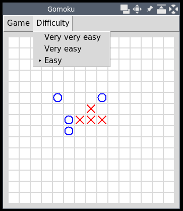

# pyGomoku
_(Tento program je zápočtovým programem z předmětu Programování I. na MFF UK.)_

**pyGomoku** je implementace hry piškvorky v jazyce python.

**Programátorská dokumentace** je dostupná na [samostatné stránce](DEV_DOCS.md).



## Minimální požadavky
- Python verze **alespoň 3.6**
- Nainstalovaný tkinter (nelze automaticky pipem)

## Instalace

_(Příklady jsou uváděny pro OS Linux, ale obdobným způsobem je možné
program instalovat i na ostatních platformách)_

1) Naklonujte tento repozitář na svůj počítač.
```
$ git clone https://github.com/Jakoma02/pyGomoku.git
```

2) Přejděte do složky s repozitářem.
```
$ cd pyGomoku
```

3) _(Volitelné)_ Aktivujte `virtualenv`
```
$ python3 -m venv venv
$ source ./venv/bin/activate
```

4) Nainstalujte tkinter _(Liší se podle distribuce)_
```
$ sudo dnf install python3-tkinter
```

4) Nainstalujte program pomocí nástroje pip.
```
$ python3 -m pip install .
```

## Použití

### Režim pro dva hráče

  1) Spusťte hru
```
$ pygomoku
```

  2) V nabídce `Game` vyberte `Multiplayer`
  3) Hrejte

### Režim s AI
  1) Spusťte hru
```
$ pygomoku
```

  2) V nabídce `Difficulty` zvolte obtížnost
  3) Hrejte
